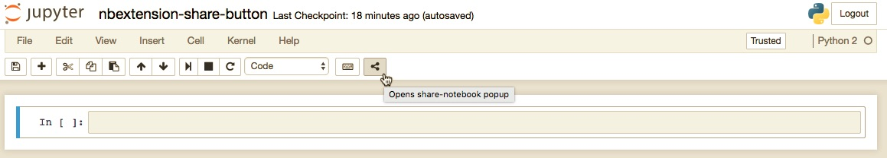
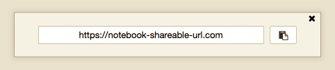

# nbextension-share-button
------------

A Jupyter Notebook extension that adds a share button to the toolbar.

Screenshots
------------
Button in the toolbar:  

Popup with the link:  

Installation
------------

Install using pip:

    pip install nbextension-share-button

Install extension:

    jupyter nbextension install [--user] --py share_button

Enable extension:

    jupyter nbextension enable [--user] --py share_button
